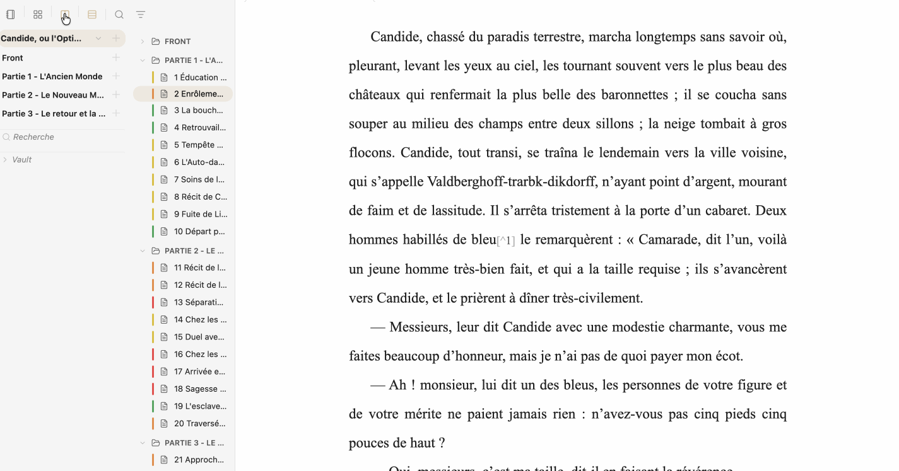
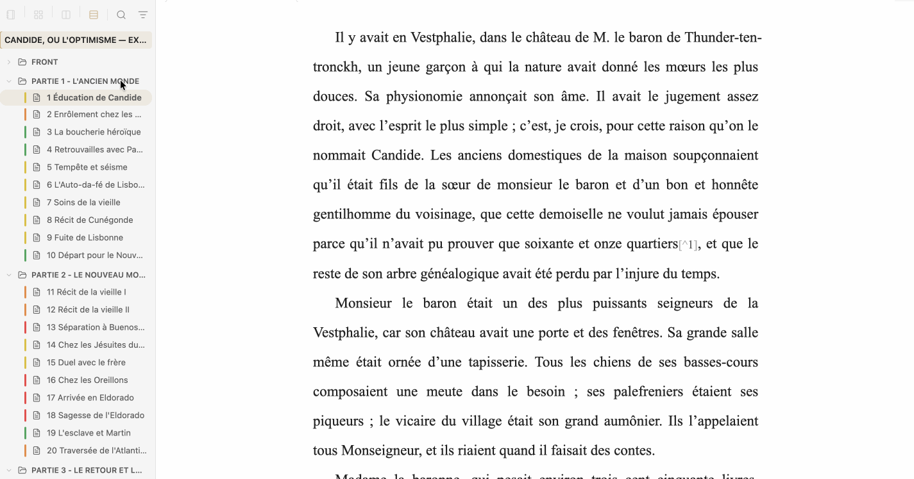
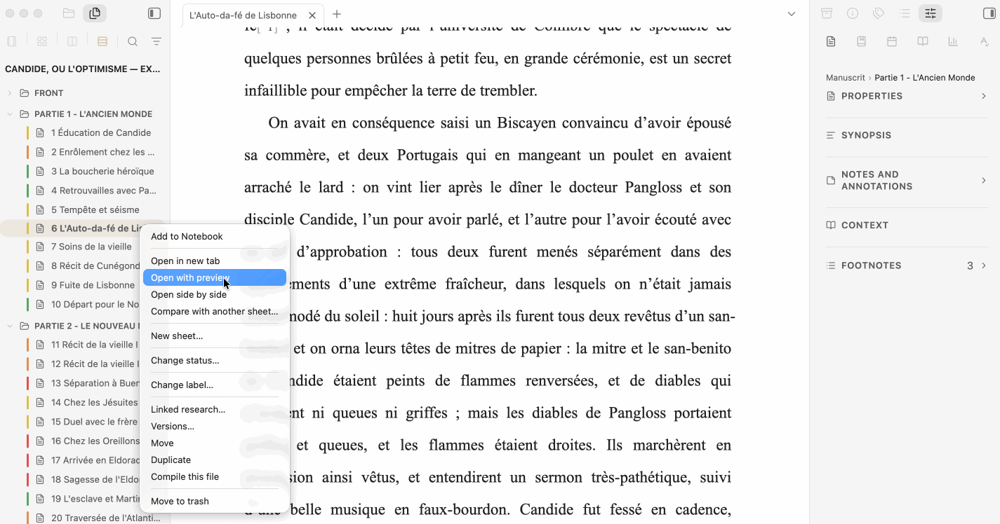

# Feuillets

**Version française: [README-fr.md](README-fr.md)**

**Website: https://sargon01.github.io/feuillets-site/**

## Write your whole book in Obsidian.

**Feuillets turns ordinary Markdown files into a complete long-form writing workflow inside Obsidian.**

Organize separate files as a manuscript, write several of them as one continuous editable document, revise your work, preview the composed book, and export it — without leaving your vault or locking your text into a proprietary project format.

**Local Markdown · No account · No telemetry · No lock-in · GPL-3.0**

| Organize | Write | Finish |
|---|---|---|
| **Binder** | **Continuous** | **Preview → Edition → Export** |

**New to Feuillets?** Create the built-in **Candide demo project** and discover the core workflow in a few minutes — no setup and no personal files required. [Start here](docs/DISCOVER.md).

> **Text before system.**



## A manuscript remains Markdown

Feuillets keeps Markdown as the manuscript and builds the author’s working environment around it.

The manuscript remains a collection of ordinary Markdown files and folders in your Obsidian vault. Feuillets does not convert the project into a proprietary format, and it does not maintain another version of the book in a parallel database.

An existing folder can become a Feuillets project without moving, renaming or converting its personal files. The same Markdown files are used by the Binder, Board, Continuous mode, Preview, proofreading and Edition. Each view provides a different way to work with the same source.

## One manuscript, several ways to work

Feuillets is an environment around the manuscript rather than a collection of unrelated views:

- the **Binder** helps structure and navigate;
- the **Board** offers Cards, Outline, Story arcs and Timeline;
- **Continuous** mode lets you write or reread several sheets as one text;
- **Preview** lets you read the manuscript as a composed document;
- **Proofreading** helps compare, review and restore work;
- **Edition** prepares the final document.

These are different working environments around the same files, not different copies of the book.

## Work locally without splitting the project

A Binder folder can become the active workspace. This creates neither a sub-project nor a copy: the author keeps the continuity of the project while some tools can adopt a local context, including Research, Notebook, Board, goals, workflow and writing typography. When a local setting is absent, supported inheritance continues through the parent, the project and global defaults.

**The project provides continuity; the workspace provides context.** See [One project, multiple workspaces](docs/WORKSPACES.md).

## One author workflow

Feuillets can accompany a long-form project through a continuous workflow:

```text
Think → organize → document → write → reread → revise → format → publish
```

- **Think** with Notebook, plans and mindmaps.
- **Organize** with Binder, Cards, Outline, Story arcs, Timeline and narrative threads.
- **Document** with Research, linked folders, citations, bibliography and Context.
- **Write** with the native Markdown editor, writing typography, Continuous mode, goals and Focus Mode.
- **Reread and revise** with Preview, annotations, snapshots, comparison, restoration, collaborative review and DOCX Review.
- **Format and publish** with Edition, Composition, Layout, templates, footnotes, bibliography and Markdown, DOCX, EPUB, ODT, PDF or Pandoc-package export, with 16:9 Presentation when relevant.

Not every project needs every step. Feuillets keeps the whole chain available while letting each author choose the parts that fit the work.

## No imposed writing method

Feuillets provides tools without imposing a narrative model. You can use only the Binder and the editor, start a quick draft, build a fiction project with narrative threads and Timeline, develop documentary work with Research and citations, prepare a course or essay, organize a trilogy as independent works inside one project, or keep a folder of independent texts.

Properties and metadata remain optional and adaptable to the project. Fiction, Non-fiction and Free are creation presets, not requirements for how a manuscript must be written.

## From one sheet to a manuscript

A sheet may remain an article, short story, column or standalone chapter. Several sheets may become a collection. A long project can progressively add:

- a hierarchical **Binder**;
- **Cards**, **Outline**, **Story arcs** and **Timeline**;
- a visual project or folder **Notebook**, with a **Binder Plan** and **mindmaps**;
- project **Research**;
- **working annotations**;
- **Continuous** mode, to write several sheets as one manuscript;
- snapshots, versions, backups and comparisons;
- native **collaborative review**;
- **DOCX Review** for Word feedback;
- the **Edition** tab for Composition and Layout;
- optional **semantic roles** for variants, extractions and collections without duplicating the manuscript;
- a 16:9 **Presentation** rendering from the same Markdown;
- Markdown, DOCX, EPUB, ODT and PDF export.
- a portable **Pandoc package (.zip)** when an external academic workflow needs a CSL-formatted result.

See [From a short text to a series](docs/FROM-SHORT-TEXT-TO-SERIES.md).

## Start with an existing folder

Any existing vault folder can become a Feuillets project **without moving, renaming or converting personal files**.

Feuillets can also create **Fiction**, **Non-fiction** and **Free** projects. Auxiliary spaces live under `_Feuillets` when needed: Research, Resources, Edition, Journal, Snapshots, Backups and Output. Historical paths remain recognized without destructive migration.


## Write

A sheet remains open in Obsidian's native Markdown editor. Feuillets can add controlled width, typography, paragraph indents, line spacing, typography helpers, manuscript-wide find/replace, footnotes, citations, typewriter scrolling and **Focus Mode**.

Use **Reorder text** to enter a local editor mode: drag a paragraph, or a selection contained within one paragraph, to a visibly marked insertion point. Press **Escape** to leave the mode; each move is one Undo step and preserves the exact Markdown.


## Organize with the Binder

The **Binder** is primarily for finding and moving text. It can:

- create, rename and move folders and sheets;
- multi-select;
- search and filter;
- isolate one folder and return to the full project;
- open a file, folder or selection in **Preview**;
- open a folder or scope in **Continuous** mode;
- link an existing Research folder from anywhere in the vault;
- switch between the **single Binder** and **split view**.

In split view, the left pane reflects the current navigation layers: **Manuscript**, **Research**, **Workspaces** and **Vault**. The right pane remains the working Binder and reflects the active workspace; it keeps the same rows, menus, selections and interactions as single view.

See [Binder and navigation](docs/BINDER-AND-NAVIGATION.md).

## Continuous mode: several files, one editable manuscript

**Continuous** mode assembles a file, folder, selection or project into **one continuous editor**. Sheet boundaries remain visible and protected; edits are redistributed to the corresponding source Markdown file.

It also supports **Reorder text** within each sheet: paragraphs or fragments contained in one paragraph can be moved, but never across a sheet boundary.

No composite manuscript is created on disk and no batch of Obsidian tabs is opened. Continuous and Preview can stay synchronized on the same scope.



See [Continuous mode](docs/CONTINUOUS-MODE.md).

## Several views of the same files

| Need | View |
|---|---|
| Navigate | Binder |
| Reorganize visually | Cards |
| Inspect information | Outline |
| Follow narrative threads | Story arcs |
| Check event order | Timeline |
| Write several sheets together | Continuous |
| Read the composed document | Preview |
| Explore freely or think around a folder | Notebook |

These views do not create parallel databases: they show the same files from different angles. The **Notebook** remains a free-form Canvas; it can be project-wide or attached to a folder and can host a **Binder Plan** or **mindmaps** without changing Markdown until an explicit Binder action is applied.

See [Notebook — from ideas to manuscript](docs/HOW-TO-NOTEBOOK.md).


## Right-hand panel

Feuillets now groups six public tabs in the right panel:

| Tab | Purpose |
|---|---|
| **Sheet** | Synopsis, summary, working notes, properties, annotations, footnotes and Context |
| **Research** | Documentation, characters, places, events, sources, bibliography and linked folders |
| **Journal** | Writing journal and tracking |
| **Edition** | Composition, Layout and editorial documents |
| **Statistics** | Sheet, selection and project statistics |
| **Proofreading** | Text analysis, collaborative review, DOCX Review and snapshot comparison |

Project configuration is opened from **Manage projects…**, where project information, goals, citations and bibliography, YAML properties, statuses, labels and tags are configured.

## Research that adapts to an existing vault

Feuillets recognizes its usual Research roots, but you can also **link any existing vault folder** to a Binder folder or sheet. Linked folders appear in the Research panel without being moved, copied or renamed. Their files can be opened in a new tab or side by side, while rename, move, duplicate and trash actions remain unavailable from this external linked-folder entry point.

See [Research and linked folders](docs/RESEARCH-AND-LINKED-FOLDERS.md).

## Project YAML property mapping

In **Manage projects… → YAML properties**, Feuillets can map its logical fields to properties already used in your vault: synopsis, summary, status, POV, label, goal, narrative thread, characters and date.

Mapping performs no destructive migration. Feuillets adapts to existing properties instead of requiring them to be renamed.

See [Project and YAML properties](docs/PROJECT-AND-YAML-PROPERTIES.md).

## Working annotations

A manuscript selection can receive a free-form annotation. The passage is highlighted in the editor, the annotation can be read, edited or deleted, and a central list lets you find annotations again.

Annotations remain **outside Markdown** and are never exported.

See [Working annotations](docs/WORKING-ANNOTATIONS.md).

## Proofreading and comparison

Before a major rewrite, take a **snapshot** of the sheet or project. Rewrite normally, then use **Compare a version** to confront the current state with that snapshot. The comparison view helps identify additions, deletions, replacements and moves, and can restore a precise passage without rolling back the whole text.

Proofreading separates several needs:

- built-in **Text analysis** and optional linguistic providers;
- native **Collaborative review** through `.feuillets` packages;
- **DOCX Review** for tracked changes and comments from Word;
- **Comparison** with a snapshot or another state.

The comparison view distinguishes additions, deletions, replacements and moves. Cut/paste operations can be recognized as moves. **Changes** mode is for handling differences; **Versions** mode removes diff decorations for side-by-side reading. Linked scrolling is optional.


See [Rewriting, backups and versions](docs/REWRITING-BACKUPS-AND-VERSIONS.md).

## Collaborative review

Feuillets can create a `.feuillets` package for one sheet, one folder or the whole project. The reviewer imports it into Feuillets, works on a local copy, adds notes and returns a package. The author imports that return, compares it with both the sent text **and** the current manuscript, then applies, ignores or handles each proposal manually.

The exchange can continue for several rounds without exposing the rest of the vault.

See [Collaborative review](docs/COLLABORATIVE-REVIEW.md).

## Edition: Composition and Layout

The **Edition** tab contains the document-production surfaces:

- **Composition**: manuscript content, First page, front matter, contents/table of contents, tables, bibliography, appendices and structure;
- **Layout**: Page, Body text, Headings and Blockquote.

The **First page** has one owner only: Composition. Its presentation uses the same template model as Preview and export.

Edition groups **Scope**, **Content**, **Format** and **Export**, alongside Preview refresh. The Content menu selects the full document, an extraction or a collection. Output file naming is no longer exposed as a normal control; Feuillets resolves it automatically while preserving legacy values for compatibility.



See [Composition and export](docs/COMPOSITION-AND-EXPORT.md).

## Semantic publishing and Presentation

Feuillets can optionally annotate selected passages with **semantic roles** such as definition, question, solution, evidence, source, summary or recommendation. Roles are never mandatory — a novel, essay or article can ignore them completely.

Those roles can then drive, without duplicating source text:

- a **content variant** that hides selected roles while keeping the document;
- a **content extraction** that keeps whole structural sections located through roles;
- a **content collection** that gathers role blocks themselves with heading context.

The same Markdown can also be rendered as a 16:9 **Presentation**. Slides are separated with `---`, layout remains automatic whenever possible, and `[!speaker-notes]` are not projected.

See [Semantic roles](docs/SEMANTIC-ROLES.md), [Content variants, extractions and collections](docs/CONTENT-VARIANTS-EXTRACTIONS-COLLECTIONS.md), [Presentation](docs/PRESENTATION-EN.md) and the [publishing tutorial](docs/SEMANTIC-PUBLISHING-TUTORIAL.md).

## Preview and export

**Preview** is the real paginated document used to judge composition. It can represent one sheet, one folder, a selection or the whole project.

### Paginated footnotes

In paginated Preview and PDF, a footnote is composed at the bottom of the page containing its first call. Its height is reserved during pagination, so body text is reduced or moved to the next page instead of overlapping the note. Repeated calls do not duplicate the note definition. In multi-column layouts, footnotes remain full-width below the columns.

The source remains ordinary Markdown (`[^1]`); only the displayed marker is smoothed in the composed document. Current limitation: a single footnote taller than the usable height of one page is not yet split across pages.

### BibTeX citations and Pandoc package

An author can place a `.bib` file, and optionally a `.csl` style, in a Research folder associated with a workspace. Type `[@` in a sheet to search the available catalog, select one or more references and add page locators. The Markdown source remains standard Pandoc citation syntax.

Feuillets can smooth citations in Preview, list cited BibTeX references in the Research panel and generate a simple bibliography. Native exports keep raw citekeys. For a university or journal workflow requiring a final CSL style, **Pandoc package (.zip)** creates a portable archive with `manuscript.md`, `pandoc.yaml`, the required `.bib` files, the optional CSL and local media. It does not run or require Pandoc, Zotero or Better BibTeX. See [BibTeX citations and Pandoc package](docs/BIBTEX-CITATIONS-AND-PANDOC.md).

Native formats:

- **compiled Markdown**;
- **DOCX**;
- **EPUB**;
- **ODT**;
- **PDF** through the desktop system print dialog.
- **Pandoc package (.zip)** for an optional external Pandoc run.

V2 templates are shared by Preview and exports. Templates can be created, duplicated, renamed, or imported from Ulysses styles and Word templates when properties can be represented.


## Import from Scrivener

On desktop, Feuillets can import a Scrivener project and recover compatible Binder structure, text, useful metadata, Research and resources. **Scrivener Binder order is now persisted explicitly**, independent of vault alphabetical sorting.


See [Import a Scrivener project](docs/IMPORT-SCRIVENER-EN.md).

## Freedom, privacy and security

- ordinary Markdown and folders;
- local operation;
- no telemetry;
- no manuscript upload to a Feuillets service;
- no Pandoc or external conversion executable is installed, located or run by Feuillets;
- collaborative review transported through `.feuillets` files explicitly exchanged by users;
- desktop Scrivener import is an explicit user action;
- GPL-3.0 source.

See [PRIVACY.md](PRIVACY.md) and [SECURITY.md](SECURITY.md).

## Installation

### Community Plugins

1. Open **Settings → Community plugins**.
2. Search for **Feuillets**.
3. Select **Install**, then **Enable**.

Feuillets requires Obsidian 1.13.0 or newer.

### Manual installation

Download `main.js`, `manifest.json` and `styles.css` from the [latest GitHub release](https://github.com/Sargon01/Feuillets/releases/latest) and place them in:

```
<your vault>/.obsidian/plugins/feuillets/
```

Then enable it in **Settings → Community plugins → Installed plugins**.

## Ecosystem

Feuillets is designed to work independently, and also pairs well with:

- **[Feuillets-Grammalecte](https://github.com/Sargon01/Feuillets-Grammalecte)** — French and English grammar checking integrated with the Proofreading panel.
- **[Courrier](https://github.com/Sargon01/Courrier)** — Word import/export and DOCX Review support.
- **[Advanced Canvas](https://github.com/Sargon01/Advanced-Canvas)** — Enhanced Canvas features for Notebook and research visualization.


## Documentation

The complete documentation is indexed in [docs/README.md](docs/README.md).

> **Feuillets — write first, build later.**
