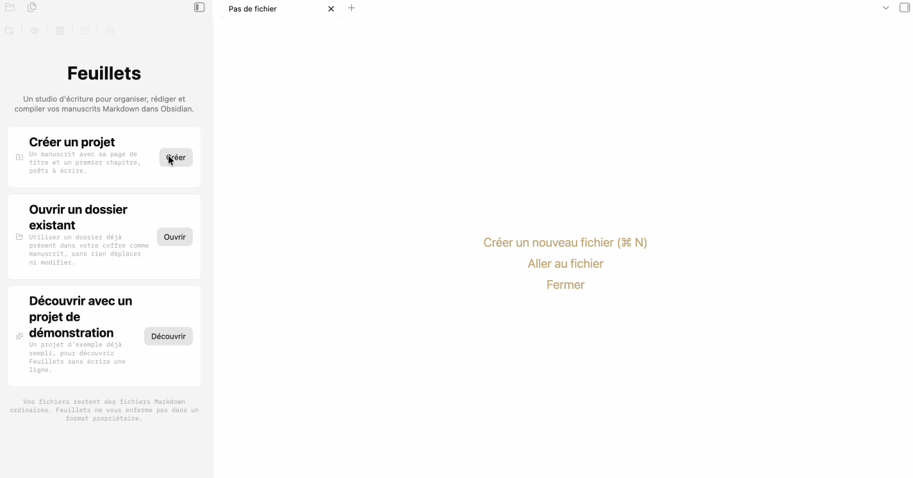
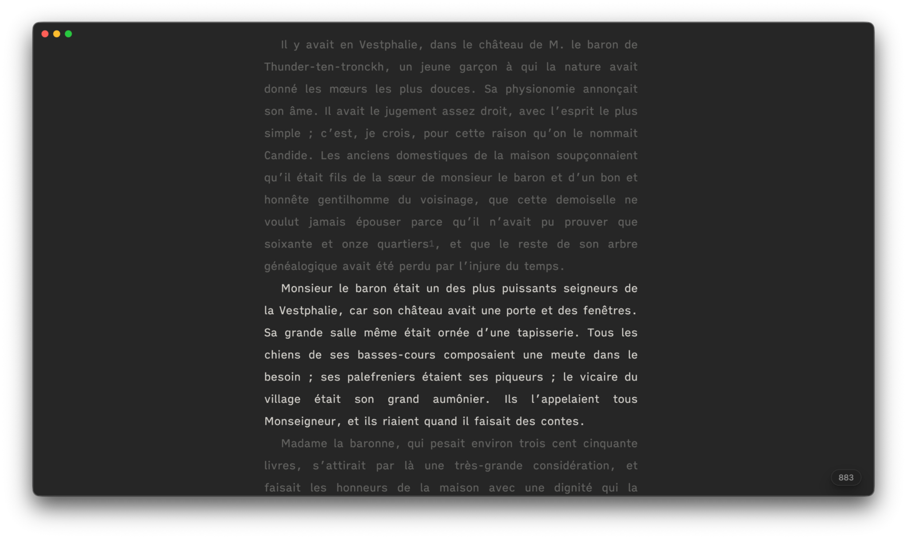
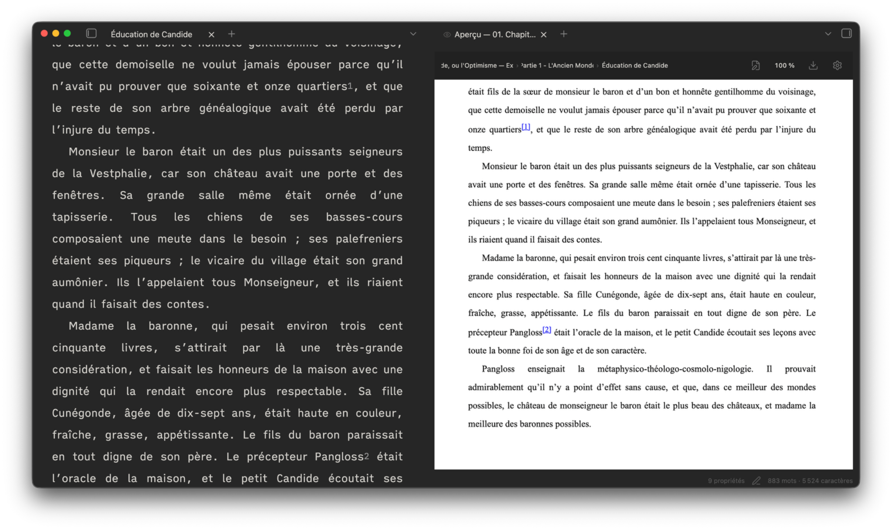
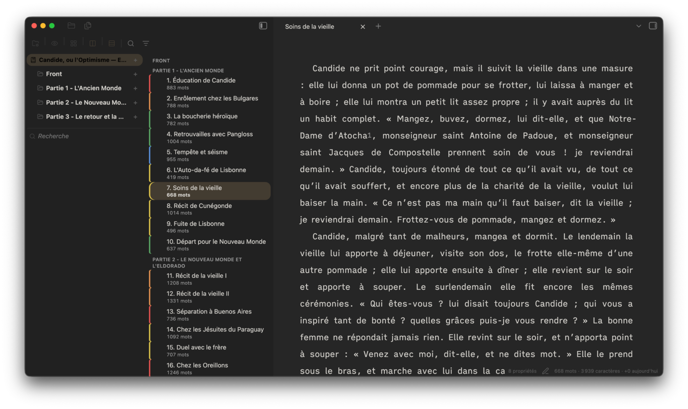
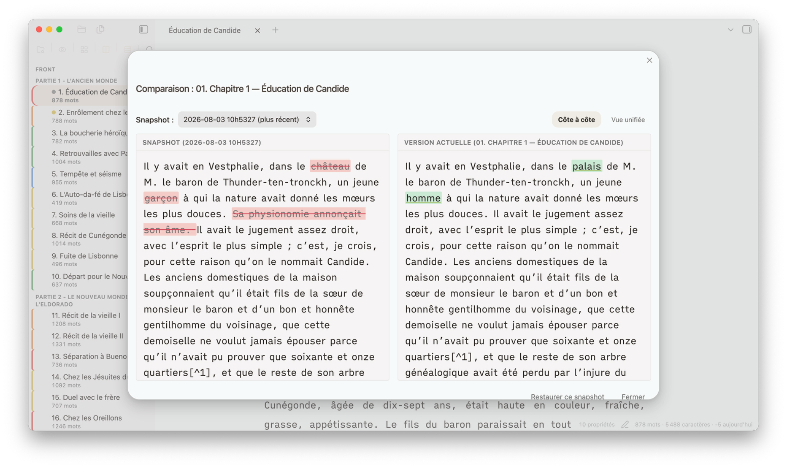
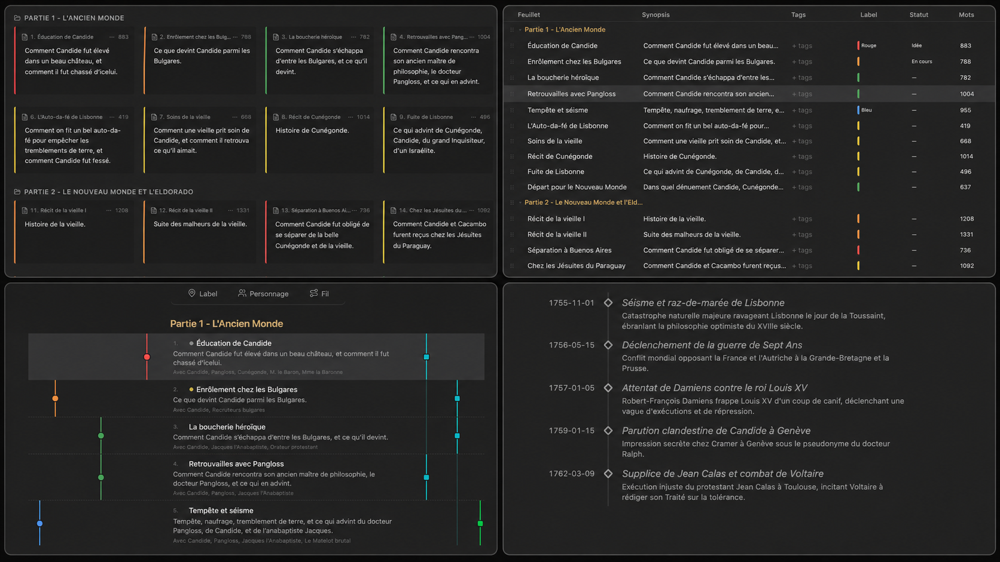
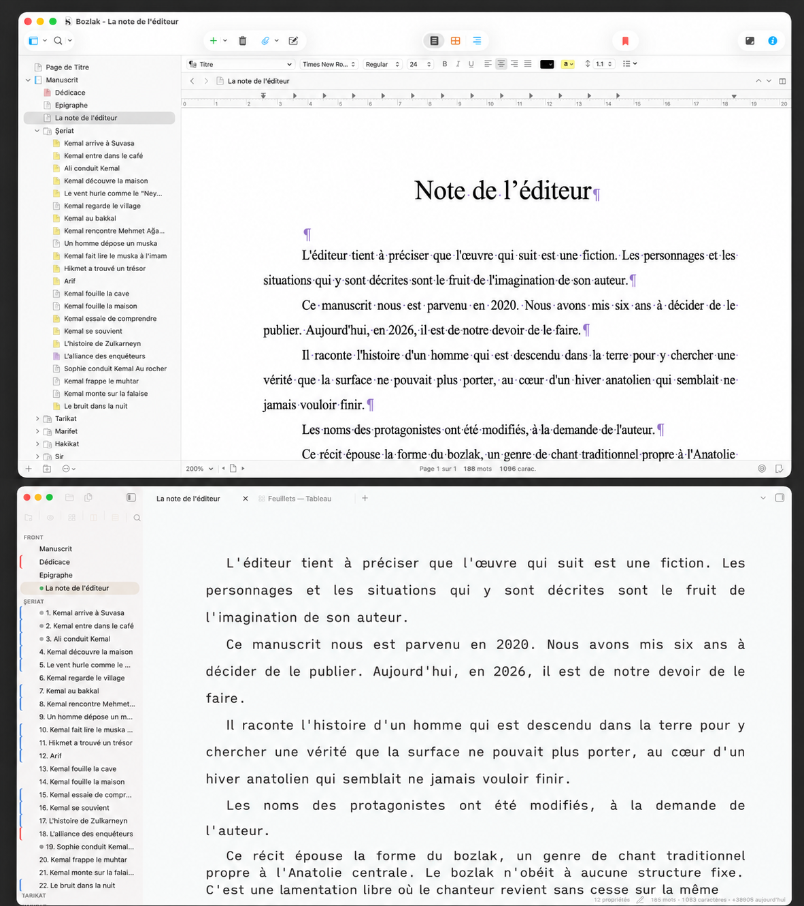
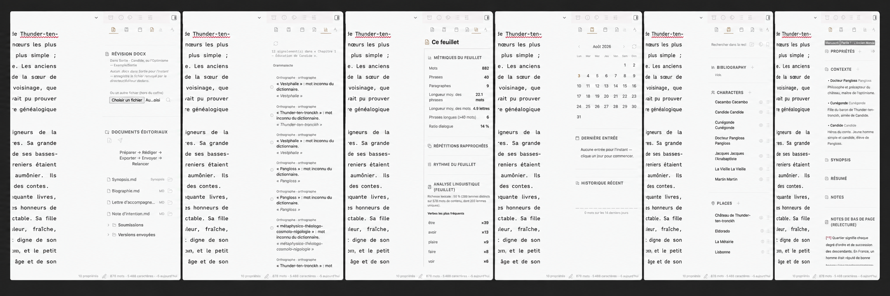

# Feuillets

## Écrivez un livre, pas une collection de notes

**Feuillets transforme Obsidian en atelier d’écriture longue, libre, local et gratuit.**

Organisez votre manuscrit dans le **Classeur**, écrivez **feuillet par feuillet**, passez en mode **Concentration**, relisez une scène, un chapitre, une partie ou le manuscrit entier dans l’**Aperçu**, puis composez et exportez votre œuvre.

> **Aussi simple qu’une page. Aussi riche qu’un projet de roman.**

Feuillets ne vous impose ni méthode unique ni interface chargée. Vous pouvez commencer avec un Classeur, un feuillet et le mode Concentration. Les outils avancés restent disponibles lorsque votre projet en a besoin.

**Conçu par un écrivain, pour le travail réel des écrivains.**

*Écrivez dans le feuillet. Relisez le livre.*

## Commencer en cinq minutes

### 1. Créez ou ouvrez un projet d’écriture

Depuis l’accueil du Classeur, vous pouvez :

- créer un projet de fiction ou de non-fiction ;
- reprendre un manuscrit existant ;
- découvrir Feuillets avec un projet de démonstration.

Un nouveau projet ouvre directement un premier feuillet prêt à écrire.

*Écrivez scène par scène dans un atelier conçu pour les manuscrits.*

### 2. Construisez le manuscrit dans le Classeur

Le Classeur présente le livre sous sa forme naturelle :

- parties ;
- chapitres ;
- scènes ;
- feuillets.

Le glisser-déposer permet de déplacer et réordonner le manuscrit. Un plan déjà préparé peut être importé en une seule fois.

### 3. Ouvrez un feuillet et écrivez

Le **feuillet** est l’unité de base de Feuillets. Il peut contenir une scène, une section ou tout fragment que vous souhaitez écrire, déplacer, comparer ou exclure indépendamment.

La vue Écriture rend la syntaxe discrète et applique au manuscrit une présentation littéraire : largeur maîtrisée, alinéas, paragraphes resserrés et typographie personnalisable.

### 4. Activez Concentration

Le mode Concentration réduit l’atelier à l’essentiel :

- texte centré ;
- largeur réglable ;
- défilement machine à écrire ;
- estompage du texte hors attention ;
- compteur de mots discret.

*Quand il faut écrire, tout le reste disparaît.*

### 5. Ouvrez l’Aperçu

L’Aperçu peut afficher :

- la scène active ;
- un chapitre ;
- une partie ;
- le manuscrit entier.

Il repose sur la même composition que les exports. Une correction effectuée dans le feuillet apparaît dans le rendu, et la navigation peut suivre la scène correspondante.

*Corrigez la scène. Jugez le livre.*

## Un outil simple qui grandit avec le manuscrit

Le parcours essentiel suffit pour écrire un livre :

> Classeur → feuillet → Concentration → Aperçu → export

Lorsque le projet grandit, Feuillets ajoute :

- Cartes pour déplacer et équilibrer les scènes ;
- Plan pour examiner les informations du manuscrit ;
- Chemin de fer pour suivre les fils narratifs ;
- Chronologie pour distinguer ordre du récit et ordre des événements ;
- Recherche pour construire la bible du projet ;
- Notes pour garder synopsis, résumé, sources et contexte à côté du texte ;
- Journal et Statistiques pour suivre le travail ;
- Révision, instantanés, sauvegardes et versions ;
- composition, modèles et exports.

La puissance de l’atelier n’oblige jamais à tout afficher.

## Pourquoi un écrivain expérimenté choisit Feuillets

### Le texte et la structure restent liés

Une scène n’est pas seulement du texte. Elle possède une place, un statut, un synopsis, des liens, des dates, des fils narratifs et parfois un objectif.

Feuillets permet de déplacer, scinder, fusionner et dupliquer les scènes sans perdre silencieusement les informations qui leur sont associées.

### Le livre reste visible pendant l’écriture

Le Classeur conserve l’architecture du manuscrit sous les yeux. L’Aperçu permet de lire le texte dans le mouvement réel du chapitre ou du livre.

*Le livre reste visible pendant que vous écrivez.*

### La réécriture reste réversible

Sauvegardes automatiques, instantanés, comparaison et duplication en nouvelle version permettent d’explorer une autre direction sans sacrifier l’état précédent.

*Réécrivez sans perdre ce que vous aviez écrit.*

### La composition n’est pas découverte après coup

La même logique de composition alimente l’Aperçu et les exports. Les titres, séparateurs, marges, polices, espacements et éléments liminaires peuvent être vérifiés avant la production du document final.

## Plusieurs manières de comprendre le même manuscrit

*Un même manuscrit, plusieurs angles de lecture.*

| Besoin | Vue |
|---|---|
| Naviguer entre parties, chapitres et scènes | Classeur |
| Réorganiser visuellement le récit | Cartes |
| Contrôler les informations et la progression | Plan |
| Observer les fils narratifs | Chemin de fer |
| Vérifier le temps du récit | Chronologie |
| Lire comme un livre continu | Aperçu |
| Explorer librement | Canvas |

## Vos textes restent les vôtres

Feuillets fonctionne localement dans Obsidian et ne nécessite aucun service en ligne pour son usage normal.

- aucun abonnement Feuillets ;
- aucune télémétrie ;
- aucun serveur imposé ;
- textes conservés en Markdown ;
- code publié sous licence GNU GPLv3.

Un projet peut être sauvegardé, synchronisé et repris avec d’autres outils. Feuillets n’enferme pas le manuscrit dans une base opaque.

## Importer un projet existant

Feuillets peut :

- ouvrir un manuscrit Markdown existant sans le déplacer ni le renommer ;
- transformer un plan structuré en parties, chapitres et scènes ;
- importer un projet Scrivener sur ordinateur afin d’en reprendre la structure, les textes et les éléments compatibles.

*Changez d’atelier, pas de manuscrit.*

## Composer et exporter

Feuillets assemble les feuillets selon l’ordre du Classeur et les règles choisies.

Selon la version et l’environnement, la composition peut être produite en :

- DOCX ;
- EPUB ;
- ODT ;
- PDF par l’impression du système ;
- Markdown compilé.

La documentation de la version installée reste la référence exacte pour les formats et leurs limites.

## Écosystème

Des modules spécialisés peuvent prolonger l’atelier :

- **[Feuillets-Grammalecte](https://github.com/Sargon01/Feuillets-Grammalecte)** : correction linguistique séparée du noyau ;
- **[Courrier](https://github.com/Sargon01/Courrier)** : contacts, correspondance, soumissions, réponses et relances.

*Écrire, corriger, soumettre : un atelier, des modules spécialisés.*

## Installation

### Depuis les modules communautaires d’Obsidian

Après acceptation dans le catalogue :

1. ouvrez **Réglages → Modules communautaires** ;
2. recherchez **Feuillets** ;
3. installez puis activez le module.

### Installation manuelle

1. téléchargez `main.js`, `manifest.json` et `styles.css` depuis la [dernière version publiée](https://github.com/Sargon01/Feuillets/releases/latest)
2. placez-les dans `.obsidian/plugins/feuillets/` ;
3. rechargez Obsidian ;
4. activez Feuillets.

## Documentation

- [Découvrir Feuillets](docs/DECOUVRIR.md)
- [Le parcours d’un auteur](docs/PARCOURS-AUTEUR.md)
- [Fonctionnalités par usage](docs/FONCTIONNALITES.md)
- [Créer une interface d’écriture épurée](docs/SETUP-INTERFACE.md)
- [Composition et export](docs/COMPOSITION-ET-EXPORT.md)
- [Réécriture, sauvegardes et versions](docs/VERSIONNAGE-ET-SECURITE.md)
- [Importer un projet Scrivener](docs/IMPORT-SCRIVENER.md)
- [Philosophie](docs/PHILOSOPHIE.md)
- [Architecture technique](docs/ARCHITECTURE.md)

> **Feuillets — l’atelier libre du manuscrit.**
