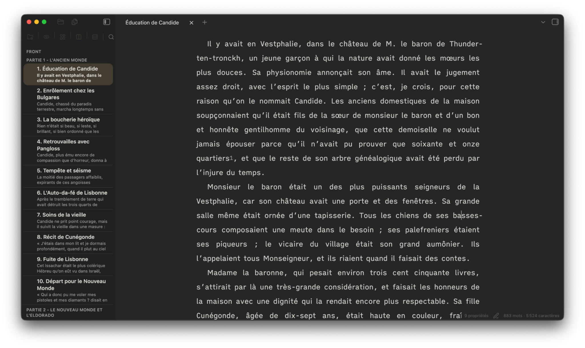

# How-to — Utiliser le contexte intelligent local de Feuillets

> [Index de la documentation](README.md)

La fonction **Contexte** se trouve dans l’onglet **Notes** de l’Inspecteur. Ce n’est pas un panneau séparé.

Elle sert à garder près du passage en cours les informations susceptibles d’être utiles : fiches de Recherche, documents associés, éléments épinglés et informations chronologiques.



Tout le rapprochement est effectué localement dans le coffre. Feuillets n’envoie pas le passage à une IA ou à un serveur de recherche.

## 1. Ce que Contexte observe

Feuillets ne relit pas nécessairement tout le feuillet à chaque mouvement du curseur.

Il extrait une **fenêtre de contexte** autour de la zone travaillée, généralement le paragraphe courant avec un peu de voisinage lorsque c’est utile.

Cette fenêtre sert à comparer le passage avec les informations disponibles.

## 2. Les sources de contexte

Plusieurs sources peuvent participer.

### Recherche liée au feuillet

Un dossier de Recherche peut être associé directement à un feuillet du Classeur.

### Recherche liée à un dossier du manuscrit

Un dossier de Recherche peut être associé à un chapitre, une partie ou un autre dossier du Classeur.

Les feuillets contenus peuvent alors bénéficier de ce contexte.

### Recherche générale du projet

Les fiches de la Recherche du projet servent aux correspondances explicites : nom, alias, tag ou référence.

### Dossiers situés ailleurs dans le coffre

Une association Recherche n’est pas obligée de pointer vers un sous-dossier du projet. Vous pouvez lier un dossier documentaire existant ailleurs dans le coffre.

L’association mémorise le chemin ; elle ne déplace pas ce dossier et ne le fait pas entrer dans la compilation du manuscrit.

## 3. Préparer une fiche

Une fiche peut être retrouvée à partir de son titre, de ses alias, de ses tags ou de certains éléments de son contenu.

Exemple :

```markdown
---
aliases:
  - Hedjaz
tags:
  - arabie
  - caravane
---

# Arabie occidentale

Les caravanes transportent des tissus et des épices entre les villes.
```

Dans le manuscrit :

> La caravane atteignit le Hedjaz avant la tombée de la nuit.

La référence explicite à `Hedjaz` peut faire remonter la fiche.

## 4. Épinglées

Une fiche épinglée reste visible pour le feuillet actif même lorsque le curseur se déplace vers un autre paragraphe.

Utilisez l’épinglage pour une information que vous voulez garder sous les yeux pendant toute une scène :

- plan d’un lieu ;
- fiche d’un personnage ;
- source principale ;
- règle d’univers ;
- chronologie locale.

L’épinglage ne copie pas le fichier. Il conserve seulement sa référence pour ce feuillet.

## 5. Références du passage

Cette section contient les correspondances les plus explicites.

Une fiche peut être reconnue lorsque le passage contient par exemple :

- son titre ;
- un alias ;
- son nom ;
- un tag pertinent dans le contexte attendu ;
- un lien Obsidian explicite.

La détection cherche une occurrence réelle du nom ou de la référence, pas une simple sous-chaîne arbitraire.

## 6. Documents associés

Cette section complète les références explicites avec une recherche lexicale dans le contenu des documents associés.

Exemple :

Passage :

> Les marchands déchargèrent leurs tissus et leurs épices.

Fiche associée :

> Les caravanes transportent des épices et des tissus précieux.

Plusieurs termes significatifs communs peuvent suffire à faire remonter la fiche, même si son titre n’est pas cité.

À l’inverse, un seul mot générique ne doit pas déclencher une avalanche de résultats.

## 7. Pourquoi la recherche de contenu est limitée

Feuillets ne parcourt pas aveuglément le corps de toutes les notes du coffre à chaque frappe.

La recherche de contenu détaillée privilégie les documents réellement associés au feuillet ou à sa structure.

Cette limite :

- évite le bruit ;
- réduit le coût de calcul ;
- rend les résultats plus explicables ;
- garde le contexte lié à l’organisation choisie par l’auteur.

## 8. Dates et chronologie

Lorsqu’un feuillet possède une date exploitable, Contexte peut rapprocher cette date des données chronologiques du projet.

Exemple :

```yaml
date: 1826-06-15
```

Une fiche Personnage peut contenir une naissance, une mort ou des états datés. Une fiche d’événement ou une information d’univers peut également posséder une période pertinente.

## 9. Alertes chronologiques

Lorsque les données sont suffisantes, Feuillets peut signaler une incompatibilité potentielle :

- personnage pas encore né ;
- personnage déjà mort ;
- âge incohérent ;
- état daté incompatible ;
- objet ou technique postérieur à la scène.

Une alerte n’est pas une correction automatique.

Un souvenir, un rêve, un mensonge ou un narrateur peu fiable peuvent rendre l’incohérence volontaire. Le rôle de Feuillets est de la montrer, pas de décider à la place de l’auteur.

## 10. Prévisualiser ou ouvrir

Selon le résultat, les actions permettent de :

- prévisualiser ;
- ouvrir la fiche ;
- l’épingler ;
- la désépingler.

L’objectif est de vérifier une information sans perdre le fil de l’écriture.

## 11. Afficher davantage

Les listes sont limitées par défaut pour ne pas transformer Notes en moteur de recherche permanent.

Lorsqu’il y a davantage de résultats, l’interface peut déplier les lignes déjà calculées sans relancer tout le contexte.

## 12. Pourquoi une fiche n’apparaît-elle pas ?

### Le curseur est ailleurs

Placez le curseur dans le passage qui contient réellement le nom, l’alias ou les termes attendus.

### Le nom n’est pas celui de la fiche

Ajoutez un alias utile à la fiche si le manuscrit emploie une autre forme.

### Il n’y a qu’un terme générique commun

Une correspondance de contenu demande suffisamment d’indices pour éviter les faux positifs.

### Les mots ne sont que synonymes

Le rapprochement de contenu reste lexical. `bateau` et `navire`, ou `étoffe` et `tissu`, ne sont pas considérés automatiquement comme équivalents.

### Le document n’est pas associé

Pour la recherche détaillée dans le corps des documents, associez le dossier documentaire au feuillet ou à son dossier du Classeur.

### La date n’est pas interprétable

Vérifiez la valeur `date` et les dates présentes dans les fiches concernées.

## 13. Ce que Contexte n’est pas

Contexte n’est pas :

- un moteur de recherche web ;
- une IA qui invente des relations ;
- un correcteur automatique ;
- une base de données séparée du coffre.

Il s’agit d’une lecture locale et explicable des informations que vous avez déjà placées dans le projet.

## À lire ensuite

- [Découvrir Feuillets](DECOUVRIR.md)
- [Fonctionnalités](FONCTIONNALITES.md)
- [Le parcours d’un auteur](PARCOURS-AUTEUR.md)
