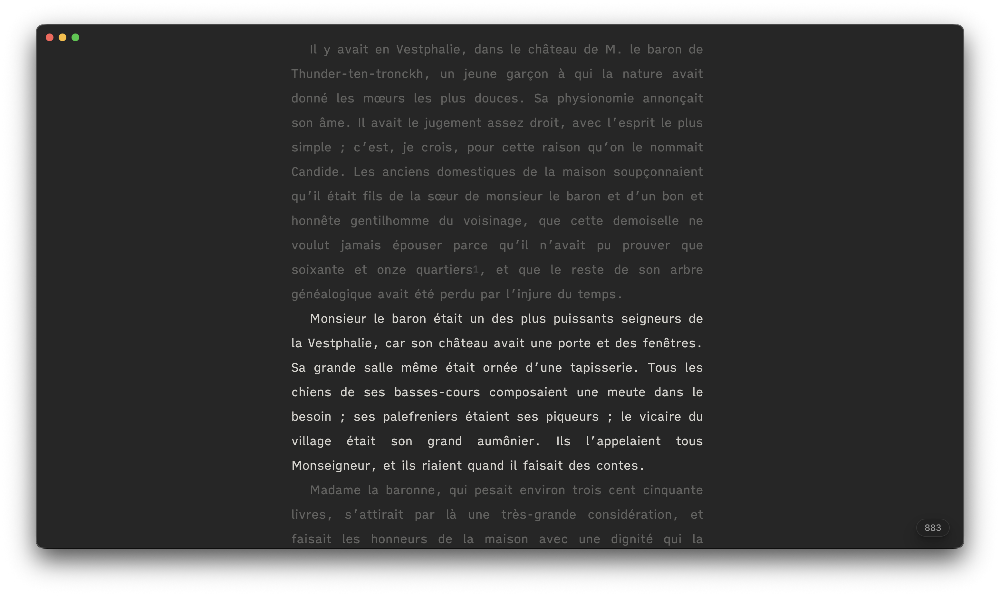

# Remplacer Ulysses par Feuillets

> **Français** · [English](REPLACE-ULYSSES-WITH-FEUILLETS.md) · [Index](README.md)

Vous utilisez Ulysses pour son écriture épurée, ses groupes et feuilles, ses objectifs et son export. Feuillets reprend ce type de workflow dans Obsidian en conservant un principe différent : **les textes restent des fichiers Markdown ordinaires dans votre coffre**.



Ulysses offre une bibliothèque unifiée et une expérience Apple très homogène. Feuillets privilégie l’ouverture des fichiers, une structure de livre explicite, la documentation du projet et l’intégration avec le reste d’Obsidian.

---

## 1. Retrouver la bibliothèque

Le coffre Obsidian joue le rôle de bibliothèque générale. Un projet Feuillets peut utiliser un dossier existant tel quel ou une structure créée par Feuillets.

| Ulysses | Feuillets |
|---|---|
| Bibliothèque | Coffre Obsidian |
| Project | Projet Feuillets |
| Group | Dossier |
| Sheet | Feuillet |
| Material Sheet | Fiche Recherche ou feuillet exclu |
| Filter | Filtre, sélection ou vue |
| Trash | Corbeille Obsidian |

Un projet peut commencer comme quelques fichiers ordinaires puis devenir un projet Feuillets plus tard, sans déplacement ni conversion propriétaire.

---

## 2. Retrouver les Projects

L’onglet **Projet** rassemble les réglages qui doivent réellement appartenir au projet : objectifs, statuts, labels, tags favoris et correspondance des propriétés YAML.

Feuillets peut donc cohabiter avec un coffre déjà organisé au lieu d’exiger une nouvelle convention de propriétés.

### Remappage YAML

Si votre coffre utilise par exemple `State`, `Summary` ou `POV`, vous pouvez les associer aux champs logiques Feuillets correspondants. Le remappage ne renomme pas les propriétés existantes et ne lance aucune migration destructive.

---

## 3. Retrouver les groupes

Les groupes deviennent de vrais **dossiers**. Ils peuvent représenter une partie, un chapitre, une catégorie, un recueil ou simplement un rangement personnel.

La même hiérarchie alimente :

- Classeur ;
- Cartes ;
- Plan ;
- Continu ;
- Chemin de fer ;
- Chronologie ;
- Aperçu ;
- composition finale.

Feuillets conserve l’ordre explicite du manuscrit. Lorsque cet ordre n’existe pas, le tri naturel sert de repli (`Chapitre 2` avant `Chapitre 10`).

---

## 4. Retrouver les Sheets

Le **feuillet** est l’unité de rédaction mobile de Feuillets.

Il peut représenter une scène, un article, une section, un fragment, une préface ou un texte autonome. Vous pouvez le créer, déplacer, renommer, dupliquer, scinder, fusionner ou exclure de la composition.

Le titre affiché peut rester distinct du nom de fichier.

---

## 5. Retrouver l’écriture épurée

Feuillets s’appuie sur l’éditeur Markdown natif d’Obsidian mais applique une présentation pensée pour le manuscrit : largeur contrôlée, syntaxe discrète, paragraphes typographiques et aides de saisie.

Le mode **Concentration** peut réduire encore l’environnement : largeur dédiée, défilement machine à écrire, atténuation du texte non actif et compteur discret.

Le texte reste du Markdown standard utilisable sans Feuillets.

---

## 6. Retrouver les vues à un, deux ou trois panneaux

Feuillets profite du système de panneaux d’Obsidian plutôt que d’imposer une disposition unique.

Le Classeur peut être utilisé en vue simple ou en **double vue** :

- structure du manuscrit à gauche ;
- petit navigateur du Coffre en lecture seule sous cette structure ;
- Classeur normal à droite.

Vous pouvez aussi masquer les panneaux ou passer en Concentration lorsque seul le texte doit rester visible.

---

## 7. Retrouver les mots-clés

Selon le besoin, utilisez :

- tags ;
- labels ;
- statuts ;
- fils narratifs ;
- personnages ;
- dates ;
- propriétés personnalisées.

Ces informations peuvent alimenter les filtres, Cartes, Plan, Chemin de fer, Chronologie et Contexte.

---

## 8. Retrouver les filtres

Le besoin couvert par les filtres Ulysses est réparti entre :

- recherche du Classeur ;
- filtres de statut, label et progression ;
- tags ;
- sélection multiple ;
- Plan ;
- Chemin de fer ;
- Chronologie ;
- recherche Obsidian.

Feuillets ne crée pas un objet « Filter » propriétaire : il s’appuie sur les mêmes fichiers et métadonnées selon la question posée.

---

## 9. Retrouver les Material Sheets

Pour la documentation non destinée au manuscrit, utilisez **Recherche** ou un dossier du coffre associé au manuscrit.

Un dossier existant n’importe où dans le coffre peut être lié à un feuillet ou à un dossier du Classeur sans être déplacé. Dans Recherche, un dossier lié extérieur est consultable en lecture seule ; ses fichiers peuvent être ouverts dans un nouvel onglet ou côte à côte.

Pour un texte qui appartient au manuscrit mais ne doit pas être exporté, utilisez l’exclusion de composition.

---

## 10. Retrouver le Dashboard

Les fonctions du Dashboard sont réparties par intention dans le panneau droit :

### Feuillet

- synopsis ;
- résumé ;
- notes de travail ;
- propriétés ;
- notes de bas de page ;
- Contexte du passage courant.

### Journal

- activité ;
- objectifs ;
- calendrier d’écriture ;
- notes de séance.

### Recherche

- personnages ;
- lieux ;
- événements ;
- concepts ;
- sources ;
- bibliographie ;
- glossaire ;
- dossiers associés.

### Projet

- réglages propres au projet ;
- statuts et labels ;
- objectifs ;
- remappage YAML.

---

## 11. Retrouver les notes et pièces jointes

Feuillets combine :

- notes de travail ;
- Recherche ;
- liens et embeds Markdown ;
- fichiers du coffre ;
- Ressources du projet ;
- Canvas/Carnet ;
- notes de dossier.

Les pièces jointes restent des fichiers identifiables plutôt que des objets enfermés dans une bibliothèque propriétaire.

---

## 12. Retrouver la consultation côte à côte

Un fichier de Recherche peut être ouvert dans un nouvel onglet ou côte à côte. C’est également possible pour les fichiers d’un dossier Recherche extérieur associé.

La double vue du Classeur permet en plus de parcourir le Coffre en lecture seule et d’ouvrir un document extérieur sans quitter l’environnement Feuillets.

Cette navigation ne transforme jamais le fichier extérieur en feuillet.

---

## 13. Retrouver une documentation liée au passage

**Feuillet → Contexte** peut faire remonter les informations utiles au paragraphe courant :

- titre ou alias cité ;
- fiche Recherche associée ;
- document partageant plusieurs termes significatifs ;
- référence épinglée ;
- information chronologique ;
- alerte de continuité dérivée des données du projet.

Le rapprochement est local et déterministe ; il ne dépend pas d’un service d’IA en ligne.

---

## 14. Retrouver les objectifs

Feuillets peut suivre :

- objectif par feuillet ;
- objectif du projet ;
- progression ;
- activité récente ;
- calendrier ;
- journal d’écriture.

Les objectifs du projet peuvent désormais être propres à chaque projet.

---

## 15. Retrouver l’organisation d’un livre

Feuillets propose plusieurs représentations du **même manuscrit** :

- **Classeur** : hiérarchie et navigation ;
- **Cartes** : réflexion visuelle ;
- **Plan** : structure et métadonnées en colonnes ;
- **Chemin de fer** : fils narratifs ;
- **Chronologie** : ordre temporel ;
- **Continu** : rédaction de plusieurs feuillets comme un seul texte ;
- **Aperçu** : document paginé avant export.

Aucune de ces vues ne crée une seconde copie du manuscrit.

---

## 16. Retrouver l’écriture continue

Le mode **Continu** assemble visuellement plusieurs feuillets dans un éditeur unique et éditable.

Vous pouvez travailler sur un chapitre, un dossier, une sélection ou le manuscrit complet comme sur un long document. Chaque modification est enregistrée dans le fichier Markdown source correspondant et les séparations entre feuillets sont protégées.

C’est particulièrement utile pour retrouver la fluidité d’une longue feuille Ulysses tout en conservant des unités de manuscrit séparées.

---

## 17. Retrouver les versions et annotations

Feuillets sépare :

- instantanés ;
- versions ;
- comparaison de textes ;
- annotations de travail ;
- sauvegardes ZIP.

Les **annotations de travail** sont attachées à des passages sans ajouter de marqueur au Markdown et ne sont pas exportées.

Le comparateur distingue ajouts, suppressions, remplacements et déplacements de passages, avec modes Changements/Versions et défilement synchronisé optionnel.

---

## 18. Retrouver les commentaires d’un tiers

Deux workflows existent selon la source du retour :

- **Relecture collaborative** : échange local de paquets `.feuillets`, commentaires et comparaison avec la version envoyée et le manuscrit actuel ;
- **Révision DOCX** : traitement des retours Word compatibles sous l’onglet Relecture.

Les annotations personnelles restent distinctes de ces deux workflows.

---

## 19. Retrouver l’export

L’espace central **Édition** sépare clairement :

### Composition

Ce qui entre dans le document : contenu, première page, pages liminaires, éléments générés, bibliographie, annexes et règles de structure.

### Mise en page

La présentation : page, corps de texte, titres, citations/séparateurs, marges, colonnes, en-têtes et pieds.

La barre supérieure d’Édition conserve en permanence la portée, le format et le bouton **Exporter**. Il n’existe pas de troisième onglet Export.

Formats natifs : Markdown compilé, DOCX, EPUB, ODT et PDF via l’impression système desktop.

---

## 20. Retrouver les styles Ulysses

Feuillets peut importer un **style Ulysses** `.ulstyle` ou `.ulss` dans **Édition → Mise en page → options du gabarit**.

L’import crée un gabarit Feuillets à partir des propriétés de style Ulysses représentables. Il ne transforme pas le manuscrit en format Ulysses et ne modifie pas les fichiers Markdown sources.

L’objectif est de récupérer une intention typographique, pas de reproduire toutes les particularités du moteur de rendu Ulysses.

---

## 21. Retrouver les formats de sortie

Feuillets peut produire :

- Markdown compilé ;
- DOCX ;
- EPUB ;
- ODT ;
- PDF sur desktop.

L’Aperçu utilise la même chaîne de composition, ce qui permet de contrôler le résultat avant export.

---

## 22. Ce que Feuillets ne cherche pas à reproduire

Ulysses reste supérieur si votre priorité absolue est :

- une application Apple entièrement homogène ;
- la synchronisation Ulysses/iCloud telle quelle ;
- la publication directe intégrée vers certaines plateformes web ;
- une bibliothèque propriétaire unique sans gestion visible de fichiers.

Feuillets privilégie au contraire l’accès direct aux fichiers et l’intégration au coffre Obsidian.

---

# Workflow quotidien équivalent

## Dans Ulysses

```text
Choisir un projet/groupe
→ écrire dans une feuille
→ ajouter mots-clés et objectif
→ consulter le Dashboard
→ choisir les feuilles
→ choisir un style
→ exporter
```

## Dans Feuillets

```text
Choisir un projet/dossier
→ écrire dans un feuillet ou en Continu
→ utiliser Feuillet et Contexte
→ associer Recherche si nécessaire
→ suivre objectifs et Journal
→ contrôler Cartes/Plan si utile
→ vérifier l’Aperçu
→ composer et exporter dans Édition
```

---

# Ce que vous gagnez

- fichiers Markdown ouverts ;
- projets qui s’adaptent à des dossiers existants ;
- remappage des propriétés ;
- vraie structure de livre sans format propriétaire ;
- mode Continu éditable ;
- Recherche et Contexte ;
- Carnet/Canvas ;
- annotations et relecture collaborative ;
- comparaison de versions ;
- composition et mise en page intégrées à l’Aperçu.

# Verdict

Ulysses reste une référence pour une expérience Apple extrêmement cohérente et minimaliste. Feuillets vise un autre équilibre : **retrouver la fluidité d’un outil d’écriture dédié tout en gardant la liberté du coffre Obsidian**.

Si vous appréciez les feuilles, la séparation rédaction/mise en page et l’absence de surcharge pendant l’écriture, mais souhaitez conserver des fichiers ouverts et disposer d’outils plus profonds pour les livres longs, Feuillets peut reprendre l’essentiel du workflow sans vous enfermer dans une nouvelle bibliothèque.
